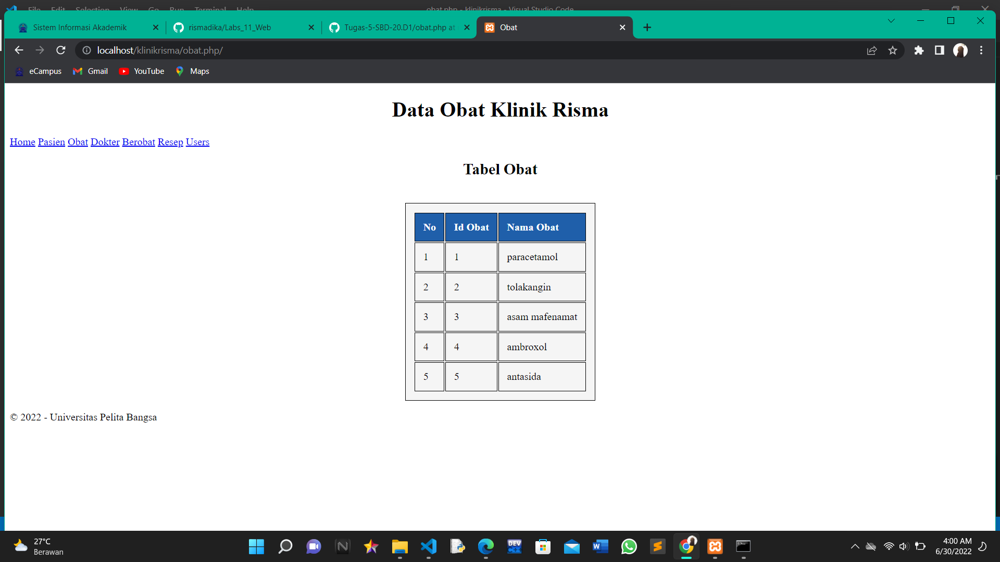

# Tugas5_SBD_20_D1
# Nama : Risma Dika Alvianti
# Kelas : TI.20.D1
# NIM : 312010051

# Soal
# 1. Menggunkan data yang dibuat dari soal Uts kemarin,Buat koneksi dengan php / bhs pemrograman lain.
# 2. Tampilkan data tabelnya masing2

# Hasil

**Home Sistem Klinik** 
 

**Tabel Pasien** 
 

**Tabel Obat** 
 

**Tabel Dokter** 
 

**Tabel Berobat** 